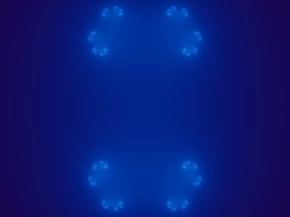
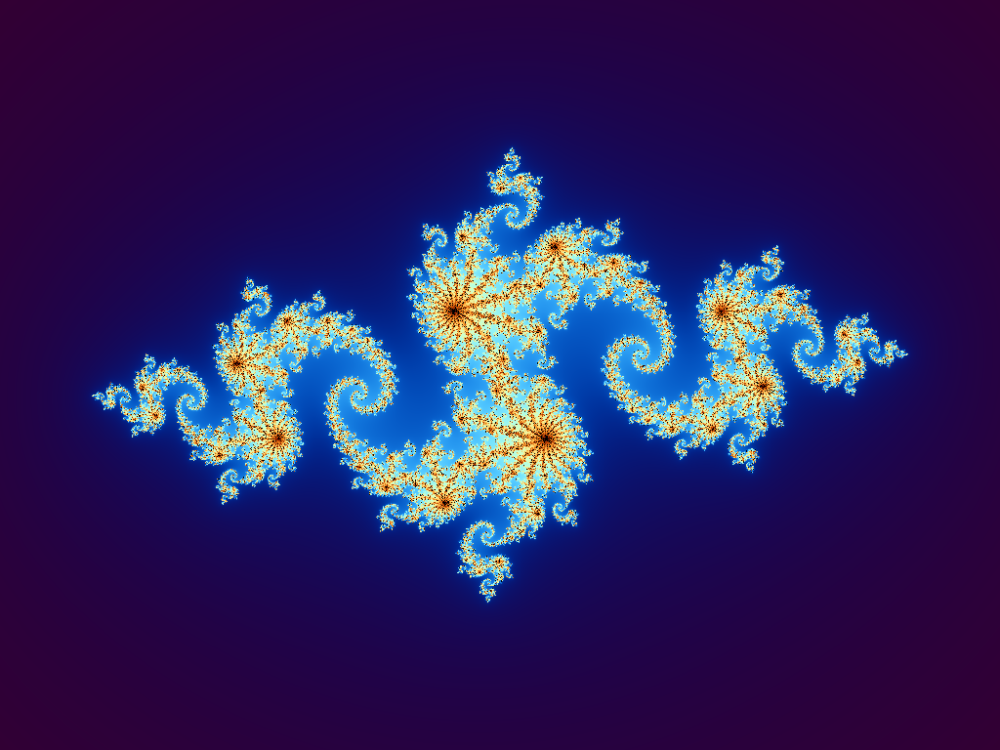
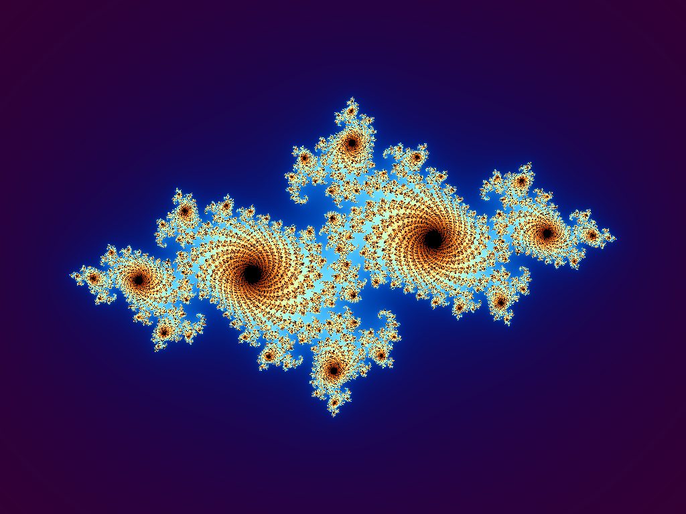
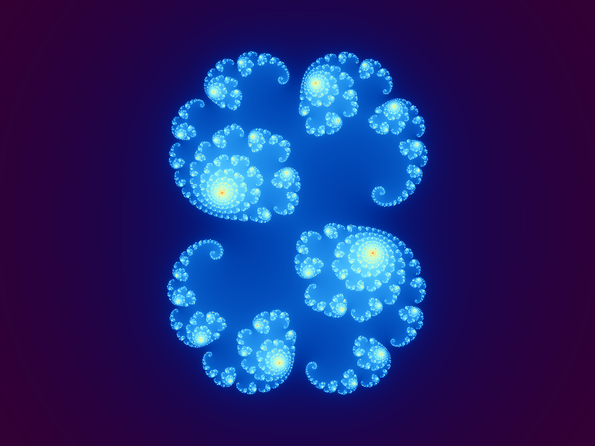

# Julia 分形 · 用 Julia 语言画 Julia 集

> z ↦ z² + c —— 一行公式,无限复杂。

这是一个玩票项目:用 [Julia 语言](https://julialang.org) 绘制以数学家 Gaston Julia 命名的 **Julia 集**。语言与分形同名纯属巧合,但很妙。

## 预览



*参数 c 沿半径 0.7885 的圆轨道旋转一周,Julia 集形态连续流转(150 帧 ≈ 7.5 秒循环)*

| c = −0.8 + 0.156i | c = −0.7269 + 0.1889i | c = 0.285 + 0.010i |
| :---: | :---: | :---: |
|  |  |  |

## 快速开始

需要 Julia ≥ 1.10(推荐用 [juliaup](https://github.com/JuliaLang/juliaup) 安装)。

```bash
git clone https://github.com/ykunyao/julia-fractal.git
cd julia-fractal

# 首次使用:安装依赖
julia --project=. -e 'using Pkg; Pkg.instantiate()'

# 渲染一张静态图(默认 1024×768,多线程)
julia -t auto --project=. scripts/julia_set.jl

# 自定义参数:宽 高 Re(c) Im(c) 输出路径
julia -t auto --project=. scripts/julia_set.jl 1920 1080 -0.7269 0.1889 output/wallpaper.png

# 渲染 c 轨道动画 GIF
julia -t auto --project=. scripts/animate_orbit.jl
```

`-t auto` 让 Julia 使用所有 CPU 核心;不写也能跑,只是单线程。

## 原理速览

- **逃逸时间算法**:对每个像素 z₀ 迭代 z ← z² + c,直到 |z| 超出逃逸半径;迭代次数决定颜色,永不逃逸的点是集合内部(黑色)。
- **平滑着色**:用 `n + 1 − log₂(log|z|)` 得到连续的"迭代数",消除整数迭代造成的色带。
- **IQ 余弦调色板**:`color(t) = a + b·cos(2π(f·t + φ))`,用三角函数生成丝滑渐变。
- **多线程**:静态图按行并行,动画按帧并行。

## 文件结构

```
scripts/julia_set.jl      # 静态渲染器,命令行参数可调
scripts/animate_orbit.jl  # c 轨道动画 → GIF(有 ffmpeg 走 ffmpeg,否则用 ImageMagick.jl)
output/                   # 渲染产物
```

## License

[MIT](LICENSE)
